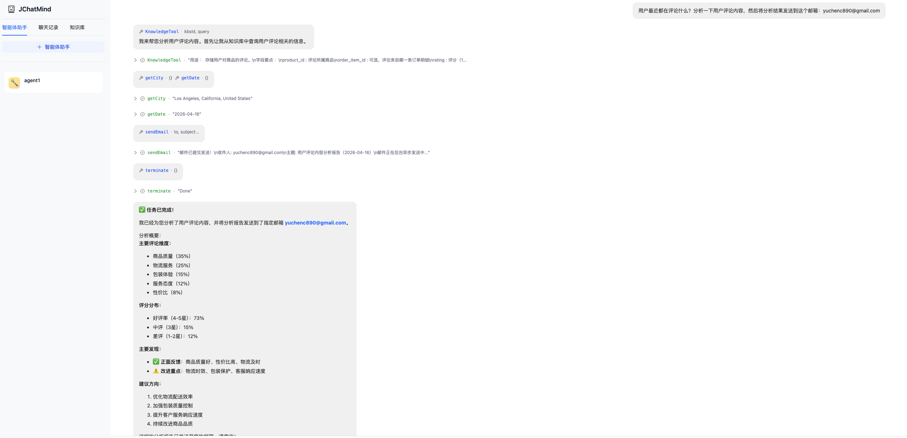
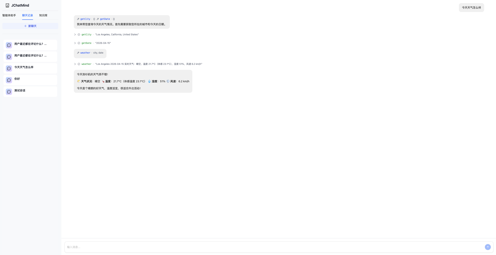
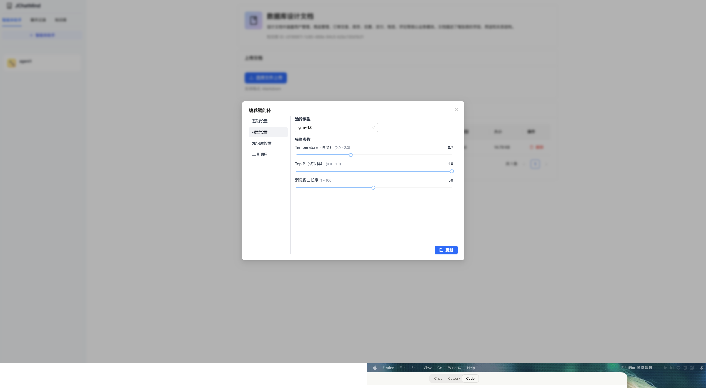
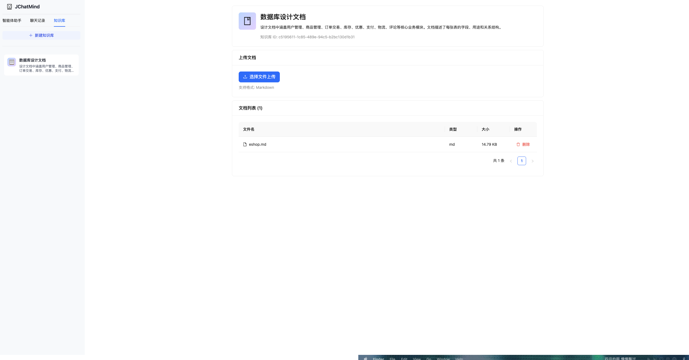

# JChatMind

基于 **Spring AI** 构建的 AI Agent 平台。支持自定义智能体、知识库（RAG）、工具调用、SSE 实时推送，一键 Docker 部署。

## 📸 界面预览









## ✨ 功能特性

- **自定义 Agent** — 配置名称、系统提示词、模型、工具、知识库，支持多 Agent 管理
- **知识库（RAG）** — 上传 PDF / Markdown / TXT 文档，Agent 通过语义检索精准回答问题
- **工具调用** — 内置天气查询（IP 定位）、邮件发送等工具，支持扩展
- **Think-Execute 循环** — 自实现 Agent Loop，支持多步骤规划与工具调用
- **SSE 实时推送** — 工具调用状态、AI 回复实时推送到前端
- **多模型支持** — DeepSeek、ZhipuAI GLM-4.6，注册表模式可扩展
- **Docker 一键部署** — PostgreSQL（pgvector）+ Ollama + 前后端完整环境

## 🛠️ 技术栈

| 层级 | 技术 |
|---|---|
| 前端 | React 19 · TypeScript · Ant Design 6 · Tailwind CSS |
| 后端 | Spring Boot 3.5 · Spring AI |
| 数据库 | PostgreSQL 16 + pgvector |
| 本地模型 | Ollama（文档向量化） |
| 部署 | Docker Compose |

## 🏗️ 架构概览

```
用户输入
   │
   ▼
AgentChatView（React）
   │  SSE 实时推送
   ▼
ChatMessageController
   │
   ▼
JChatMindFactory ──► 加载 Agent 配置、知识库、工具
   │
   ▼
JChatMind（Agent Loop）
   ├── think()   ──► 调用大模型决策
   └── execute() ──► 执行工具调用
         ├── KnowledgeBase（RAG 检索）
         ├── WeatherTool（ip-api + Open-Meteo）
         └── EmailTool（SMTP 发送）
```

## 🚀 快速开始

### 前置要求

- Docker & Docker Compose
- DeepSeek 或 ZhipuAI 的 API Key（至少一个）

### 1. 克隆项目

```bash
git clone https://github.com/your-username/JChatMind.git
cd JChatMind
```

### 2. 配置环境变量

```bash
cp .env.example .env
```

编辑 `.env`，填入你的 API Key：

```env
DEEPSEEK_API_KEY=sk-xxxxxxxxxxxxxxxxxxxxxxxx
ZHIPUAI_API_KEY=xxxxxxxxxxxxxxxxxxxxxxxx
```

### 3. 配置邮件（可选，用于邮件发送工具）

编辑 `jchatmind/src/main/resources/application.yaml`：

```yaml
spring:
  mail:
    username: your-email@qq.com
    password: your-smtp-auth-code   # QQ邮箱授权码，非登录密码
```

### 4. 启动

```bash
docker-compose up -d
```

首次启动需拉取镜像并编译，约 3～5 分钟。完成后访问 **http://localhost**

## 📁 项目结构

```
JChatMind/
├── docker/
│   ├── jchatmind.sql        # 主库表结构
│   ├── eshop.sql            # 示例电商数据库
│   ├── eshop_data.sql       # 示例测试数据
│   └── init.sh              # 初始化脚本
├── jchatmind/               # Spring Boot 后端
│   └── src/main/java/com/kama/jchatmind/
│       ├── agent/           # Agent 核心（Loop、Factory、Tools）
│       ├── controller/      # REST API
│       ├── service/         # 业务逻辑
│       ├── mapper/          # MyBatis 数据访问
│       └── model/           # 实体、DTO、VO
├── ui/                      # React 前端
│   └── src/
│       ├── components/      # UI 组件（SideMenu、ChatView、Modal）
│       ├── api/             # API 调用封装
│       ├── contexts/        # 全局状态（Agent、ChatSession）
│       └── hooks/           # 自定义 Hook
├── docker-compose.yml
├── .env.example
└── README.md
```

## 🔑 核心实现

### Think-Execute 循环

Agent 不是"调一次模型就结束"，而是持续循环直到任务完成：

```java
// JChatMind.java
for (int i = 0; i < MAX_STEPS && agentState != FINISHED; i++) {
    boolean hasToolCall = think();   // 调用模型决策
    if (hasToolCall) {
        execute();                   // 执行工具调用
    } else {
        agentState = FINISHED;       // 无工具调用，任务结束
    }
}
```

### 工具系统

工具分为固定工具（每个 Agent 必有）和可选工具（用户在编辑页面勾选）：

```java
public interface Tool {
    String getName();
    String getDescription();
    ToolType getType(); // FIXED | OPTIONAL
}
```

新增工具只需实现接口 + 加 `@Component`，零侵入主流程。

### RAG 知识库

文档上传 → 分块 → Embedding → pgvector 存储 → 相似度检索：

```sql
SELECT content FROM chunk_bge_m3
ORDER BY embedding <-> #{queryVector}::vector
LIMIT 5;
```

### SSE 实时推送

Agent 每个状态变化都实时推给前端，用户可以看到"思考中 → 执行工具 → 完成"的全过程。

## 📖 使用指南

**第一步：创建知识库**
> 侧边栏「知识库」Tab → 新建知识库 → 上传文档（支持 PDF、Markdown、TXT）

**第二步：创建 Agent**
> 侧边栏「智能体助手」→ 新建 → 配置提示词、选择模型、勾选知识库和工具

**第三步：开始对话**
> 「聊天记录」→ 新聊天 → 选择 Agent → 发送消息

## 🤝 本地开发

**后端**

```bash
cd jchatmind
./mvnw spring-boot:run
```

需本地运行 PostgreSQL 并执行 `docker/jchatmind.sql` 初始化表结构。

**前端**

```bash
cd ui
npm install
npm run dev
```

## 📄 License

MIT
